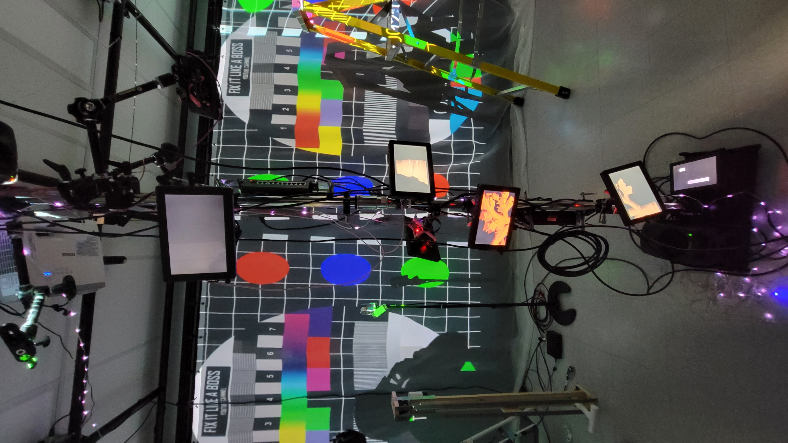
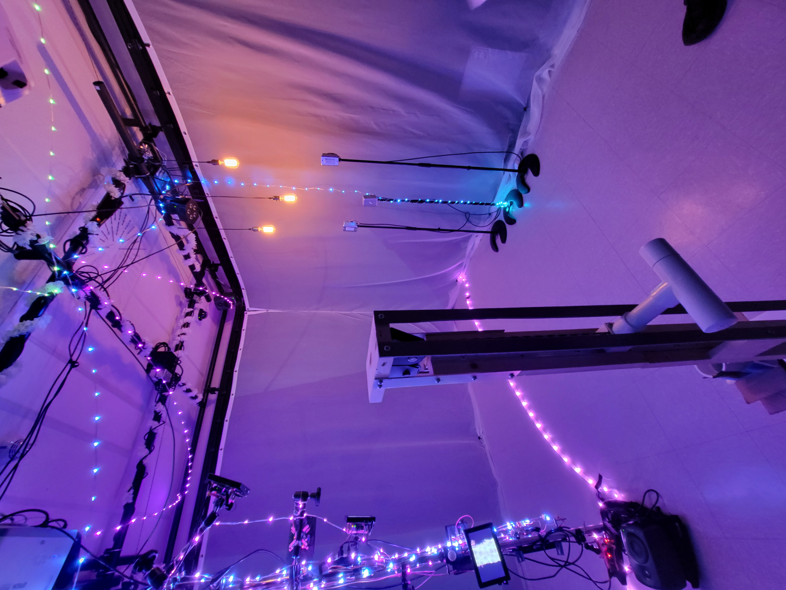
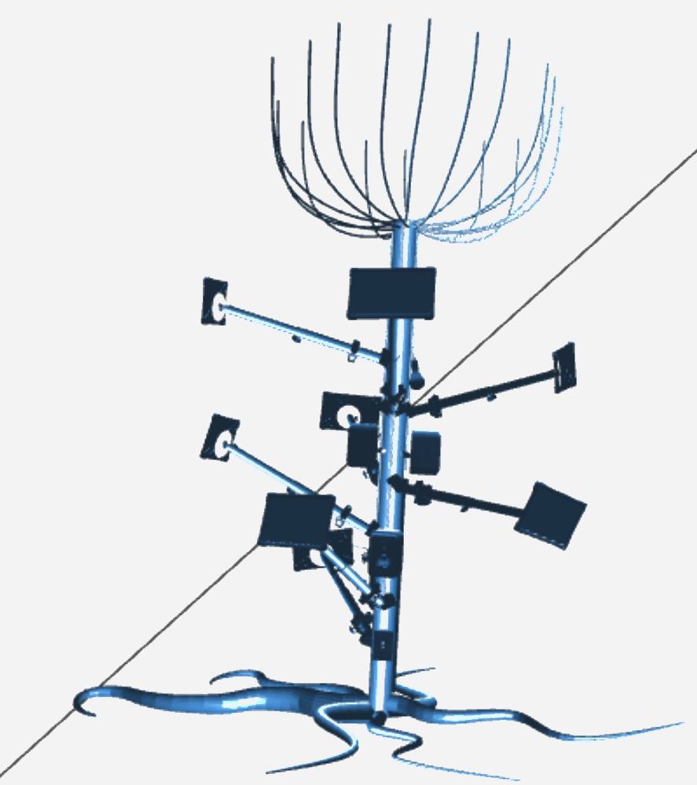

## **Effet Papillon**
Créateurs : Raphaël Dumont, Alexis Bolduc, William Morel, Alexia (Ryan) Papanikolaou, Viktor Zhuravlev et Jasmine Lapierre.
## le lien de chacun avec le thème Crescentia
Le lien avec Crescentia est que l'environnement évolue comme pour représenter le cycle de la vie sur Terre.
## l'installation en cours dans les studios
En ce moment, l'installation est dans le petit studio, avec le matériel interactif placé et les projecteurs prêt à afficher les interactions avec le matériel.

source : Emmanuel Ricard

## Schéma
source : https://github.com/Iteration6/Effet-Papillon/blob/2b2e73f72208211f2ff77f123d528beb9cf9ef03/docs/preproduction/medias/stl_structure.stl
   

## 3 cours du programme incontournables pour créer ce genre projet
Œuvres et dispositifs multimédias en exposition, Interactivité ludique et modélisation 3D semblent être des cours incontournables pour la création de cette oeuvre.

    présenter une technique* ou une composante technologique* qui sera utilisée dans l'un des projets et que vous ne connaissiez pas

    *pour cette partie, vous devrez faire des recherches pour mieux connaitre la technique et la composante technologique retenues

   ## Ordre de préférence
Avant l'expérimentation, je trouve que ce projet est mon 4er préféré, car il est attirant par sa façon de faire ressentir à quel point la nature est précieuse, et que chaque geste que l'on fait peut entraîner une réaction en chaîne.

## Expérience à ressentir
Je crois que je vais expérimenter de la fascination, car le fait de voir que chaque geste posé est le début d'une réaction en chaîne me fascine.

source d'informations : https://tim-montmorency.com/2024/projets/Effet-Papillon/docs/web/preproduction.html
