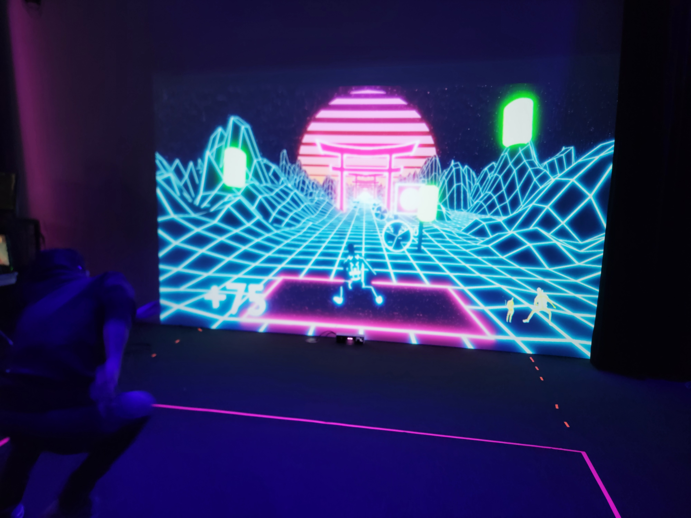
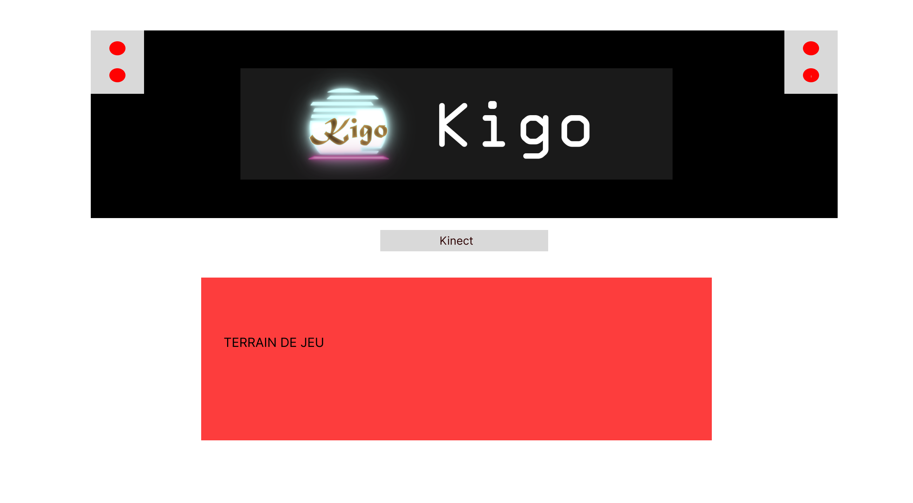

## **Kigo**
Créateurs : Érick Ouellette, William Rathier Mailly, Gabriel Clerval, Nicolas St-Martin, Antoine Dion
## le lien de chacun avec le thème Crescentia
le thème de Crescentia est la croissance, et c'est relié parce que tu dois faire évoluer ton score au fil du temps, au risque de tout perdre et de devoir recommencer de zéro.

## l'installation en cours dans les studios pour chacun des projets 
En ce moment, l'installation est situé sur un mur, avec une image projeté par un projecteur. Il y a une Kinect pour capter les mouvements et tout ça est relié à un ordinateur, donc modifiable en temps réel. développer

source : Emmanuel Ricard
 

## Schéma
source : https://tim-montmorency.com/2024/projets/Kigo/docs/web/preproduction.html
   

## 3 cours du programme incontournables pour créer ce genre projet
Œuvres et dispositifs multimédias en exposition, Interactivité ludique et modélisation 3D semblent être des cours incontournables pour la création de cette oeuvre.

## Ordre de préférence
Avant l'expérimentation, je trouve que ce projet est mon 1er préféré, car il est attirant par sa façon d'utiliser le matériel, étant simplement de bouger sans rien avoir besoin de manipuler.

Source d'information : https://tim-montmorency.com/2024/projets/Kigo/docs/web/preproduction.html

## Expérience à ressentir
Je crois que je vais expérimenter du plaisir à m'amuser à esquiver les obstacles et obtenir le plus haut score.

