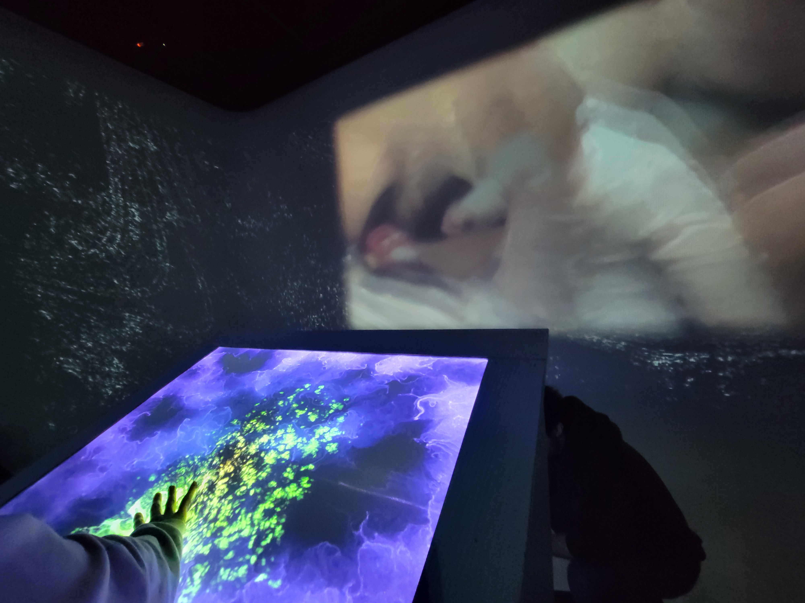
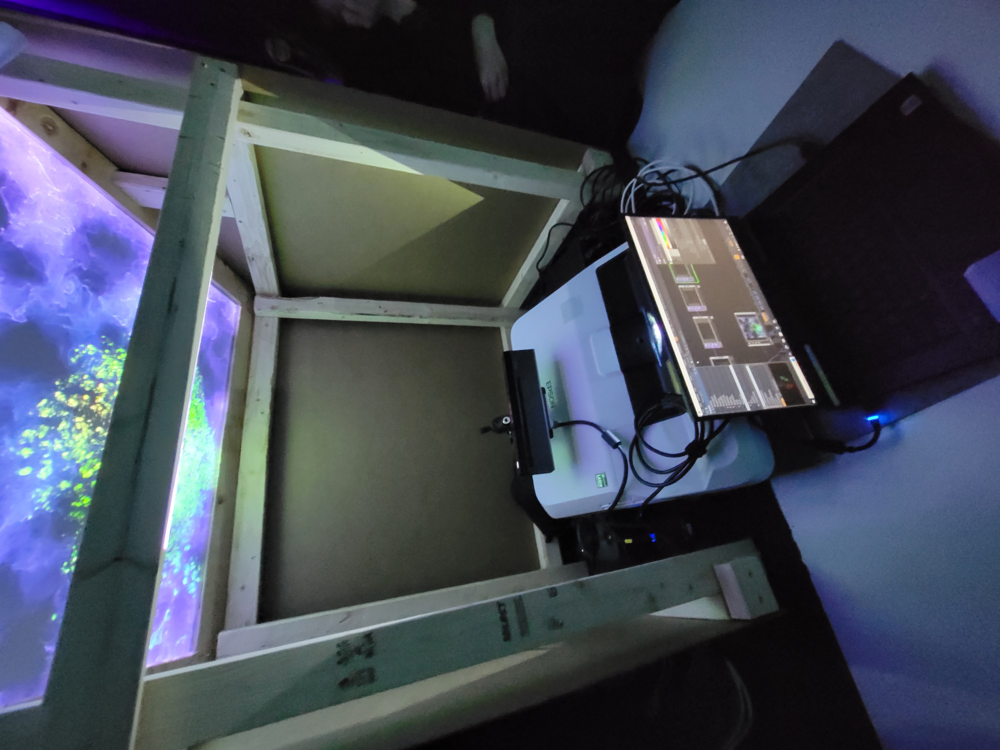

1faire comme si c'était sortie personnelle

## **Rhizomatique**
Une oeuvre faite à partir de l'exposition Crescentia. Créateurs : Maïka Désy, Laurie Houde, Jolyanne Desjardins, Félix Testa.

réalisée en 2024, visité le 20 mars 2024
## Lieu de l'exposition
Collège Montmorency, Laval
dans le local/studio C-1712
l'exposition était temporaire, car elle n'a durée publiquement qu'une semaine. Elle était intérieure, car elle se passait dans un local.
## Le lien avec le thème Crescentia
Le thème de Crescentia est la croissance, et c'est relié parce que le projet parle de la mémoire et des souvenirs qui arrivent et disparaisse au fil des temps.

## Description de l'oeuvre
Rhizomatique est une oeuvre interactive ayant pour but simuler une vue des souvenirs du cerveau d'une personne en appuyant sur un semi-tapis. Les souvenirs s'affichent à l'aide de projecteurs sur un mur, sois en face, à gauche ou à droite, selon où la main de l'interlocuteur se situe. Comme indiqué dans la description du site de Rhizomatique, l'oeuvre a pour but de "relier l'humain et le temps" en utilisant la méthode de faire oublier la notion du temps à l'interlocuteur en allant visiter les souvenirs passés d'une personne qu'elle ne connait pas.

source : https://tim-montmorency.com/2024/projets/Rhizomatique/docs/web/index.html

## Type d'installation
L'installation est de type immersive, car elle t'immerse dans les pensées d'une personne inconnu, en jouant avec du son et la vue d'une vidéo de fond qui joue. Elle est aussi interactive, car une fois après avoir interagis avec la toile prévu à cet effet, la vue vidéo change pour des vidéos de souvenirs, en face, à gauche ou à droite, selon où l'interlocuteur a appuyé sur la toile. le son change aussi pour le son de la vidéo qui est en train de jouer, ce qui, tout mis bout à bout, renforce encore plus l'immersion apportée.

## Fonction du dispositif multimédia
Le scénario parle de l'histoire d'une personne qui revois des souvenirs d'une personne inconnue. Elle met en valeur le temps qui passe rapidement sans que l'on prenne le temps de s'arrêter et de profiter des souvenirs passés. La diffusion ce fait sur plusieurs murs, Exposés par des projecteurs, avec une toile interactive face au mur de devant et des haut-parleurs qui projètent le son. Il y avait aussi un Kinect qui servait à capter les mouvements de l'interlocuteur pour les transférer à l'ordinateur qui s'occupera de quoi transmettre comme données aux projecteurs et aux haut-parleurs.

## Mise en espace
L'installation se fait dans le grand studio. Elle se fais avec une toile (représentant le cerveau) et une projection sur 3 grand murs (l'affichage les souvenirs). Plus tu pèses longtemps, plus il va jouer longtemps et clairement, plus tu appuies rapidement, plus ils vont disparaître. Avoir le son de la vidéo mémoire avec un son de fond pour représenter l'émotion véhiculé dans la vidéo. une lumière au-devant de la toile attirera les gens, avec des modèles artistiques proejtés et sur la toile. puis dès qu'un interlocteur s'approchera, la lumière s'éteindra. les modèles artistiques partiront petit à petit.

Source : Emmanuel Ricard

## Schéma de l'installation
Source : https://tim-montmorency.com/2024/projets/Rhizomatique/docs/web/preproduction.html

## 3 cours du programme incontournables pour créer ce genre projet
Œuvres et dispositifs multimédias en exposition, Interactivité ludique et Traitement audiovisuel semblent être des cours incontournables pour la création de cette oeuvre.

## Ordre de préférence
avant l'expérimentation, je trouve que ce projet est mon 3ème préféré, car il est attirant avec sa façon de fonctionner et de synchroniser les contenus audios, visuels et physiques.

## Expérience vécue
Je crois que je vais expérimenter des émotions fortes, car elle va jouer avec les sentiments en nous immersant dans l'expérience.

source d'informations : https://tim-montmorency.com/2024/projets/Rhizomatique/docs/web/index.html
