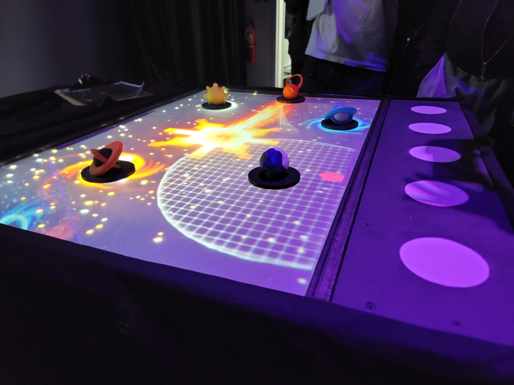
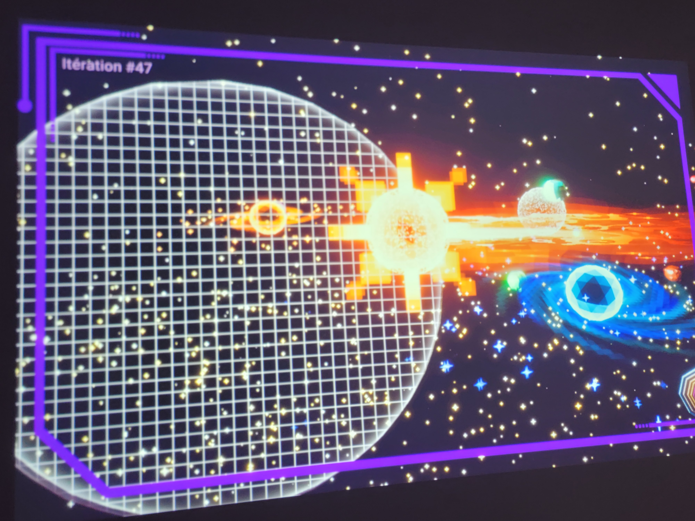

## **Canevas Cosmique**
Créateurs : Jacob Alarie-Brousseau, Étienne Charron, Jérémy Cholette, Quoc Huy Do, Mikaël Tourangeau
## Le lien avec le thème Crescentia
Le thème de Crescentia est la croissance, et c'est relié parce qu'en reliant les planètes, ça fait croître des phénomènes galactiques.

## L'installation dans les studios
L'installation est situé sur un mur, avec une image projeté par un projecteur. Il y a une Kinect pour capter les mouvements des mains sur une table située devant le mur, où est situé des planètes de forme 3D. Il y a un projecteur avec une kinect en dessous de la table pour projeter les images et capter les mouvements émis par les interlocuteur.

Source : Emmanuel Ricard

 

## Schéma
Source : https://tim-montmorency.com/2024/projets/Canevas-Cosmique/docs/web/preproduction.html
   

## 3 cours du programme incontournables pour créer ce genre projet
Œuvres et dispositifs multimédias en exposition, Interactivité ludique et animation 2D semblent être des cours incontournables pour la création de cette oeuvre.

## Ordre de préférence
Avant l'expérimentation, je trouve que ce projet est mon 5ème préféré, car il est intéressant, mais ne suscite pas mon attention plus que ça.

## Expérience à ressentir
Je crois que je vais expérimenter de la fascination vis-à-vis des explosions émises par les collisions de planètes. 

Source d'informations : https://tim-montmorency.com/2024/projets/Canevas-Cosmique/docs/web/index.html
