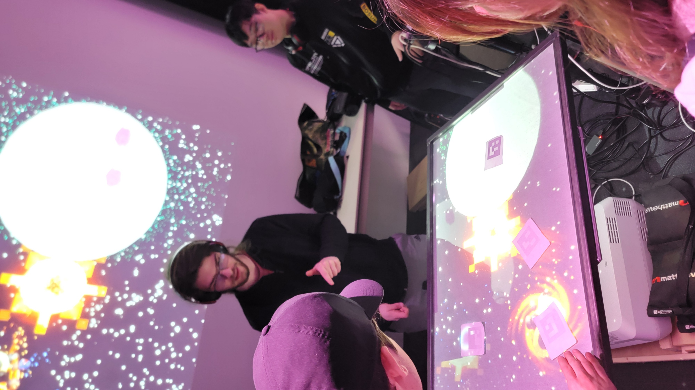

## **Canevas Cosmique**
Jacob Alarie-Brousseau, Étienne Charron, Jérémy Cholette, Quoc Huy Do, Mikaël Tourangeau
## le lien de chacun avec le thème Crescentia
le thème de Crescentia est la croissance, et c'est relié parce qu'en reliant les planètes, ça fait croître des phénomènes galactiques.

## l'installation en cours dans les studios pour chacun des projets 
En ce moment, l'installation est situé sur un mur, avec une image projeté par un projecteur. Il y a une Kinect pour capter les mouvements des mains sur la table devant le mur, où est situé des planètes.
 

## Schéma
   

## 3 cours du programme incontournables pour créer ce genre projet
Œuvres et dispositifs multimédias en exposition, Interactivité ludique et animation 2D semblent être des cours incontournables pour la création de cette oeuvre.

    présenter une technique* ou une composante technologique* qui sera utilisée dans l'un des projets et que vous ne connaissiez pas

    *pour cette partie, vous devrez faire des recherches pour mieux connaitre la technique et la composante technologique retenues

## Ordre de préférence
Avant l'expérimentation, je trouve que ce projet est mon 5ème préféré, car il est intéressant, mais ne suscite pas mon attention plus que ça.

## Expérience à ressentir
Je crois que je vais expérimenter de la fascination vis-à-vis des explosions émises par les collisions de planètes. 

.
    le titre de chacun des projets ainsi que ses créateurs et créatrices
    le lien de chacun avec le thème Crescentia
    l'installation en cours dans les studios pour chacun des projets (photos à l'appui)
    le schéma de l'installation prévue (insérer le schéma de plantation de chacun des projets, avec la source)

De plus, vous devrez :

    identifier et indiquer 3 cours du programme qui vous semblent incontournables pour avoir les compétences pour créer ce genre projet (voir la grille de cours du programme)

    présenter une technique* ou une composante technologique* qui sera utilisée dans l'un des projets et que vous ne connaissiez pas

    *pour cette partie, vous devrez faire des recherches pour mieux connaitre la technique et la composante technologique retenues

    ordonner les projets selon votre préférence actuelle (1 = votre projet préféré), avec justification (avant/après l'expérimentation)

    noter ce que vous croyez que vous ressentirez en expérimentant chacune des installations, avec justification

Vous définirez la structure de votre présentation, en insérant des titres clairs, en intégrant des photographies lorsque cela est pertinent et en créant des fichiers agréables à lire, dans lesquels on repère facilement l'information
