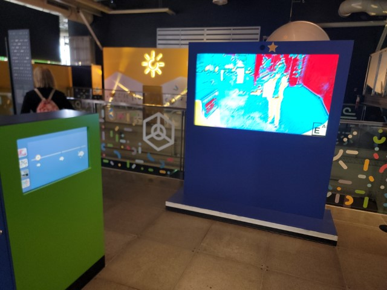
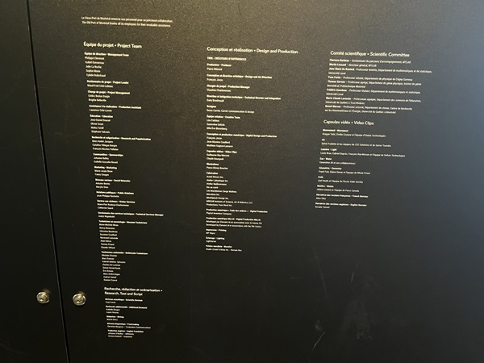
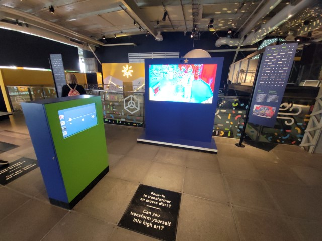
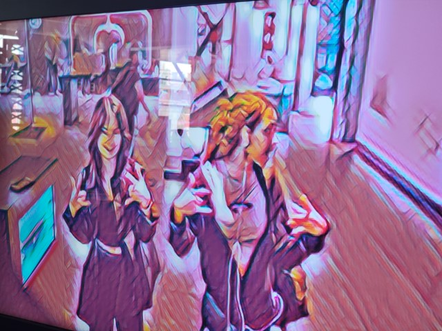
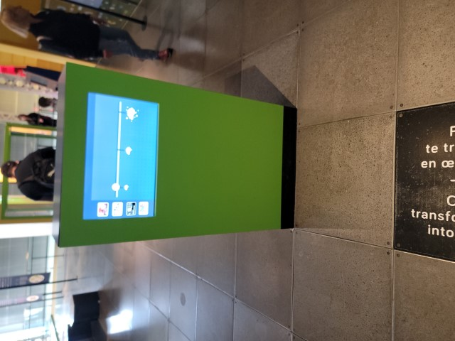
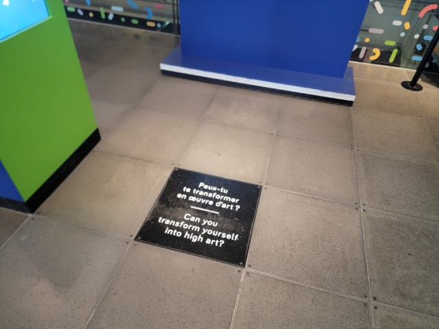

# Centre des sciences de Montréal
*date de visite : 10 avril 2024*

Source : https://www.centredessciencesdemontreal.com/exposition-permanente/explore

## Lieu de mise en exposition
2 Rue de la Commune Ouest, Centre des sciences de Montréal.

Source : Emmanuel Ricard

## Type d'exposition
L'exposition est permanente et se retrouve à l'intérieur du Centre des sciences à Montréal.

Source : Emmanuel Ricard

## Titre de l'oeuvre ou du dispositif
Intelligence Artificielle

Source : Sylvie Francois

## Nom de l'artiste ou de la firme
TKNL - Créateurs d'expérience est la firme qui a développé ce projet.

Source : Sylvie Francois

## Année de réalisation
2019

source : https://www.centredessciencesdemontreal.com/exposition-permanente/explore

## Description de l'oeuvre ou du dispositif
La disposition montre comment notre image peut être déformée grâce à l'intelligence artificielle.

## Type d'installation
Le type d'installation est plutôt contemplative, car l'interlocuteur se mets en face d'un écran pour voir lui et son environnement se déformer devant lui. Elle est aussi un peu interactive, car il y a un écran à la gauche qui est interactif, permettant de modifier le degrée de l'effet que l'intelligence artificielle génère.

Source : Emmanuel Ricard

## Fonction du dispositif multimédia
L'exposition sert à montrer ce à quoi le ou les interlocuteur(s) peuvent ressembler en étant une image générée par intelligence artificielle. Elle sert aussi à les mettre en action, car l'oeuvre ne fonctionne que s'ils bougent et s'ils interagissent avec l'écran tactile pour modifier le niveau d'effets.

Source : Emmanuel Ricard

## Mise en espace
La partie visuelle est composée d'un écran de taille moyenne en face, d'une affiche à droite explicative de l'oeuvre, d'un mémo au sol incitant à mettre ses pieds dessus et un écran à gauche pour montrer le degrée d'intelligence artificielle utilisée. Il y a aussi une partie interactive, étant l'écran de gauche, pour définir le degrée d'intelligence artificielle utilisé. Il y a aussi le mouvement de l'interlocuteur, car en bougeant, il modifie ce qui est capté par la caméra au dessus de l'écran, donc modifier ce qui est affiché sur celui-ci.

Source : Emmanuel Ricard

## Composantes et techniques
Les composantes et les techniques utilisés sont les écrans, un ordinateur, une caméra, une affiche et du texte collé au sol. Les écrans servent à afficher le contenu, la caméra à capter les mouvements émis par son champ de vision (dont les interlocuteurs) et l'ordinateur à transformer l'information reçue par la caméra et la transmettre à l'écran. L'affiche sert à transmettre de l'information à propos de l'oeuvre et le message au sol à inciter les interlocuteurs à essayer l'oeuvre.

Source : Emmanuel Ricard

## Éléments nécessaires à la mise en exposition
Pour permettre l'exposition de cette oeuvre, il faut avoir les équipements suivant :un écran de taille moyenne pour projeter l'image, une caméra, un ordinateur, un plus petit écran tactile, une pastille avec de l'écriture dessus, une affiche, des fils et de l'espace.

## Expérience vécue
L'oeuvre ne demande que peu d'effort physique, car il ne faut que se déplacer dans un petit espace et toucher un écran. Elle procure de l'émerveillement face à la contemplation de se voir sous une toute autre forme que ce que l'on a l'habitude de ce voir.

## ❤️ Ce qui m'a plu
Beaucoup d'éléments m'ont plus, tel que le peu d'effort physique et mental est demandé pour contempler cette oeuvre interactive. Elle demande à l'interlocuteur d'interagir avec sans lui demander d'efforts, pour être accessible à tous. Tout le monde peut aller admirer cette oeuvre et elle est intuitive à contrôler. L'idée est intéressante et m'inspire pour de futurs projets.

## 🤔 Aspects que je ne retiendrais pas ou ferais autrement
J'offrirais plus de possibilité d'effets à utiliser. car nous sommes assez limité par rapport aux nombres d'effets possible à transmettre sur l'écran. De plus, je n'ai pas aimé la couleur utilisé pour les structures, je mettrais des couleurs plus modernes et attirantes, tel que du blanc cassé, du terracotta ou du bleu Klein.

Sources :

Emmanuel Ricard

Frédérique Ménard Aubin

https://pacmusee.qc.ca/fr/expositions/detail/spectacle-multimedia-generations-mtl/

