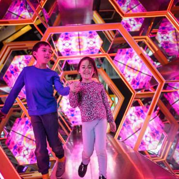
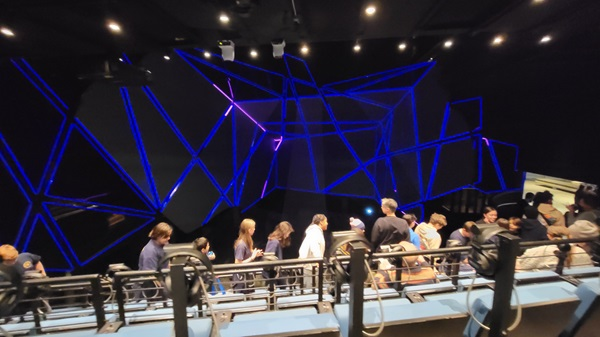

# Centre des sciences de Montréal
*date de visite : 10 avril 2024*

Source : https://www.centredessciencesdemontreal.com/exposition-permanente/explore

## Lieu de mise en exposition
350 place royale Montréal

Source : Emmanuel Ricard

## Type d'exposition
L'exposition est permanente et se retrouve à l'intérieur de l'édifice de Pointe-à-Callière.
Source : Emmanuel Ricard

## Titre de l'oeuvre ou du dispositif
Spectacle multimédia Générations MTL
Source : https://pacmusee.qc.ca/fr/expositions/detail/spectacle-multimedia-generations-mtl/

## Nom de l'artiste ou de la firme
Pointe-à-Callière est la firme qui a développé ce projet.
Source : https://pacmusee.qc.ca/fr/expositions/detail/spectacle-multimedia-generations-mtl/
## Année de réalisation
2024?

## Description de l'oeuvre ou du dispositif
La disposition parle de l'histoire du Québec et de ses origines. Elle est comporté de plusieurs écrans, d'écouteurs, de projecteurs et de néons. L'oeuvre dûre environs 17 minutes.
Source : https://pacmusee.qc.ca/fr/expositions/detail/spectacle-multimedia-generations-mtl/

## Type d'installation
Le type d'installation est plutôt contemplative, car l'interlocuteur est assis sur une chaise et regarde de multiples écrans qui sont face à lui. Il y a aussi un peu d'immersion, car tu dois porter des écouteurs qui jouent du son tel que de la voix et de la musique pour t'immerser durant l'exposition.

Source : Emmanuel Ricard

## Fonction du dispositif multimédia
Le scénario parle de l'histoire du Québec depuis sa création jusqu'à aujourd'hui. Elle met en valeur tout ce que le Québec a traversé et toutes les créations que cette belle province a apporté. La diffusion ce fait sur plusieurs écrans, séparés de Néons, de projecteurs visant sur le sol pour projeter des éléments et d'écouteurs pour avoir une immersion plus profonde de l'oeuvre. Il y avait aussi des vitres avec des personnages projetés de temps en temps dessus.

Source : Emmanuel Ricard

## Mise en espace
La partie visuelle prend la largeur d'un grand mur complet et de la moitié des deux murs sur les côtés. Elle prend aussi une partie du plancher. La partie avec les chaises pour que les visiteurs regarde est derrière, avec les écouteurs posés sur des socles entre les sièges. au dessus de cette partie, il y a des projecteurs pour projeter les images sur les vitres et au sol. Sur le mur de droite est située la porte pour rentrer dans la pièce.

Source : Emmanuel Ricard

## Composantes et techniques
Les composantes et les techniques utilisés sont la projection, la lumière, le son et la superposition. Certains projecteurs projetaient l'image sur le sol, ce qui rajoutait à l'immersion, tandis que d'autres projetaient sur des vitres invisibles, ce qui permettait de voir des personnes lorsque l'histoire en avait besoin, et lorsque la vitre n'avait rien d'affiché dessus, de voir ce qui se passe derrière sur les écrans. Aussi, les lumières tels que les néons entre les écrans permettent de rajouter à l'immersion en faisant des effets qui vont avec ce qui est affiché et projeté sur les écrans. Pour finir, le son joue une grande partie dans cette oeuvre, car il y a des voix qui expliques ce qui se passe, à quelle époque nous sommes et il y a des sons avec de la musique pour nous immerser dans l'oeuvre.

Source : Emmanuel Ricard

## Éléments nécessaires à la mise en exposition
Pour permettre l'exposition de cette oeuvre, il faut avoir les équipements suivant : des projecteurs pour projeter les images, des lumières pour projeter de la lumière, des néons pour faire de la lumière, des sièges pour s'asseoir, des écouteurs pour entendre le son, de la vitre et des écrans pour recevoir la projection et un très grand espace divisé en plusieurs partie (une plus haute, et une plus basse).

## Expérience vécue
L'oeuvre ne demande aucun effort physique, elle demande seulement à s'asseoir sur un siège, mettre les écouteurs et regarder l'exposition pour expérimenter un voyage au fil des années et revivre les événements marquant du Québec, plus précisément de Montréal. Elle procure de l'émerveillement et de la fierté vis-à-vis tout ce que Montréal a pu faire et ce qu'il est devenu aujourd'hui.

Source : Emmanuel Ricard

## ❤️ Ce qui vous a plu, vous a donné des idées
Beaucoup d'éléments m'ont plus, tel que les sièges étaient disposés plus haut que la partie du sol ayant de la projection, ce qui fait un effet de projection plus agréable à regarder. Quelque chose qui m'a donné des idées est le fait qu'à la place de mettre les personnages au même stade de projection que les décors, Ils ont mis des vitres où les projecteurs projettent la vidéo des personnages sans fond, ce qui créé un sentiment de réel et de rapprochement entre l'interlocuteur et l'exposition. Ça m'a beaucoup plu, car ça l'a rajouté à mon immersion et à la complicité que je ressentais avec les personnages, tout en permettant de bien admirer le paysage sans avoir de fonds encombrants derrière les personnages. 

## 🤔 Aspect que vous ne souhaiteriez pas retenir pour vos propres créations ou que vous feriez autrement
Je ferais des moments plus courts pour les vidéos de fond à certain moments, car parfois Il ne se passait pas grand chose donc ça peut faire perdre l'attention des interlocuteurs. Si j'avais pu le faire autrement, j'aurais laissé des fonds avec des passages moins intéressant sur certains écrans, mais j'aurais aussi mis des sujets plus intéressant avec pour capter l'attention tout en émerveillant les interlocuteurs.

Sources :

Emmanuel Ricard

Frédérique Ménard Aubin

https://pacmusee.qc.ca/fr/expositions/detail/spectacle-multimedia-generations-mtl/

Nom de l'exposition ou de l'événement 	Affiche de l'exposition 	
Lieu de mise en exposition 	Vous devant l'entrée de l'édifice 	
Type d'exposition (temporaire, permanente, itinérante, intérieure, extérieure) 		
Date de votre visite 		
Titre de l'oeuvre ou du dispositif 	Vue d'ensemble de l'oeuvre ou du dispositif 	
Nom de l'artiste ou de la firme 		Pour le nom de la firme, voir le panneau de crédits de l'exposition
Année de réalisation 		
Description de l'oeuvre ou du dispositif 	Cartel + diverses vues 	À composer ou reprendre la description offerte sur le site de l'artiste ou sur le cartel en indiquant bien sa source
Type d'installation (contemplative, immersive, interactive) 	Vue parlante - vidéo ET photo qui nous permettent de bien comprendre le type d'installation 	---
Fonction du dispositif multimédia (scénographie, mise en valeur, mise en contexte, support pédagogique, diffusion du patrimoine immatériel) 	Vue parlante - vidéo ou photo qui nous permet de bien comprendre la fonction du dispositif multimédia 	
Mise en espace 	Vue d'ensemble de la pièce + croquis de la mise en espace (plan ou élévation selon ce qui facilite la compréhension, avec dimensions) 	Texte qui permet de comprendre comment l'oeuvre ou le dispositif est mis en espace : dans quelle pièce, sur quel mur, quel est l'espace occupé, comment est-ce disposé... ?
Composantes et techniques 	Parties composantes de l'oeuvre ou du dispositif (il est possible d'utiliser des images tirées de sites internet pour faciliter la compréhension si les photos prises ne sont pas claires) 	Liste des composantes et techniques utilisées (ce que l'artiste ou la firme a fait - pensez à ce qui doit voyager dans une caisse de transport si ceci est exposé outremer)
Éléments nécessaires à la mise en exposition 	Éléments de mise en exposition (il est possible d'utiliser des images tirées de sites internet pour faciliter la compréhension si les photos prises ne sont pas claires) 	Liste des éléments nécessaires à la mise en exposition (ce que le musée a mis en place pour que l'oeuvre ou le dispositif soit exposé (bancs, cache-fil, crochets, sacs de sable, câbles, herses, projecteurs...)
Expérience vécue 	Posture du visiteur ou gestes de l'interacteur 🎥 possibilité d'intégrer de courts vidéos pour documenter les actions de l'oeuvre ou du dispositif ou l'interactivité avec l'oeuvre ou le dispositif 	Texte qui explique ce qui est attendu du visiteur ou de l'interacteur. Où et comment se positionne-t-il/elle? Que faut-il faire? Comment réagit l'oeuvre ou le dispositif (si interactivité)? Plus personnellement, description de l'expérience que l'oeuvre ou le dispositif vous a fait vivre.
❤️ Ce qui vous a plu, vous a donné des idées 	Éléments pertinents 	Texte à rédiger qui présente un ou des aspects inspirants, avec justifications détaillées (pourquoi est-ce que cela vous a plus/ vous a donné des idées ?
🤔 Aspect que vous ne souhaiteriez pas retenir pour vos propres créations ou que vous feriez autrement 	Éléments pertinents 	Texte à rédiger qui présente un ou des aspects que vous ne retiendriez pas ou feriez autrement, avec justifications détaillées (pourquoi? comment?)
Références 		hyperliens vers les sites consultés

Compiler les fichiers et notes à la suite de chacune des visites ou rencontres
Renommer les fichiers par un nommage conforme et par l'utilisation de mots clés clairs et concis (avant l'ajout des fichiers dans votre repository)
Redimensionner les fichiers des photographies (avant l'ajout des fichiers dans votre repository)
Dans votre repository, créer le dossier voulu, puis l'arborescence de ses fichiers et dossiers (chacun des dossiers doit contenir un fichier README.md qui en détaille le contenu)
Pour chacune des expositions visitées, créer un fichier nommé fiche_EXPO_Oeuvre_Retenue.md (remplacer EXPO par le nom de l'exposition et Oeuvre_Retenue par le nom de l'oeuvre ou du dispositif)
À partir des aspects notés et photographiés, créer une fiche de présentation des informations bien structurée (titres, sous-titres, cohérence de la présentation, intégration soignée d'appuis visuels...)
Intégrer les informations demandées dans la fiche créée
Faire des recherches complémentaires pour enrichir l'information (ex : site de l'exposition, site web de l'artiste, de la firme recherche sur les composantes...)
Élaborer des justifications lorsque nécessaire (le pourquoi)
Insérer les sources de vos informations et les crédits photos lorsque requis
Poser des questions à la professeure !
