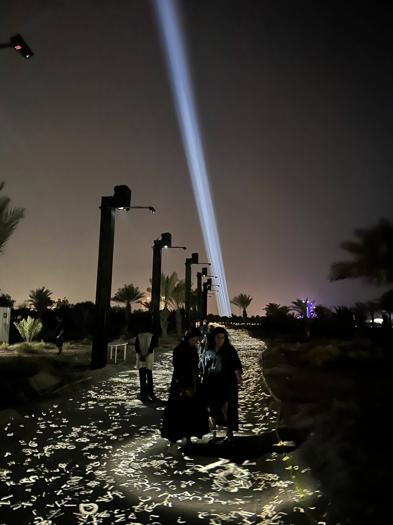

# Studio Antimodular (Rafael Lozano-Hemmer)
*Présentation par Jade Séguela, registraire*

source : https://www.lozano-hemmer.com/translation_stream.php

Conférence impeccable. La présentatrice appuyait bien ses propos, avec des images de références et des informations pertinentes qui permettaient de nous mettre en situation. Elle m'a permis d'en apprendre d'avantage sur ce Studio créé par un homme remarquable du nom de Rafael Lozano-Hemmer. Tous les obstacles et épreuves qu'ils ont dû surmonter était impressionnants et bien décrits.

## Présentation du fondateur du studio
Rafael Lozano-Hemmer est d'origine mexicaine et est né en 1967. Il est à l'origine de la création du studio en 2023 et possède un B. Sc en chimie physique à l'université de Concordia à Montréal en 1989. Il fait de l'art mélangeant technologie, poésie, politique et la science, tout en étant interactives où chaque interaction émise par l'interlocuteur est importante.

## Quel est le rôle de la présentatrice dans la conception des œuvres ?
Jade Séguela est registraire pour le studio. C'est elle qui va s'occuper de l'exportation du matériel, de s'assurer de tout avoir les éléments nécessaires au bon fonctionnement de l'œuvre lors de son exportation et du déplacement de l'œuvre. Avant chaque exportation, elle doit faire une liste d'envoi pour assurer que chaque élément est bien présent pour ne pas oublier de pièces qui pourrait nuire au fonctionnement de l'œuvre.

## Qu'est-ce qui a été présenté ?
lors de la présentation, nous avons pu en appendre d'avantage sur le métier de la présentatrice, mais nous avons aussi pu en apprendre plus sur les valeurs véhiculés par le fondateur, les œuvres qui ont été conçus par le studio et le processus derrière la création de ceux-ci. Nous avons, par exemple, pu entendre parler des enjeux liés au lieu d'exposition des œuvres, de la corrosion à la faune, pour permettre le bon fonctionnement et la sécurité de l'œuvre. Nous avons aussi appris que la plupart de ses œuvres fonctionnent avec des caméras, car elles permettent de capter les mouvements effectués par les interlocuteurs le fondateur veut aussi toujours créditer l'équipe derrière chaque œuvre, parce qu'il trouve important d'énumérer toutes les personnes ayant rendu possible le projet.

## Présentation d'œuvres
Plusieurs œuvres ont été présentés lors de la conférence, tel que Au clair de la lune et Flux de Mouvement. Par exemple, pour Flux de mouvement, nous avons pu apprendre qu'elle a dû être fait en à peine trois mois, imposé par les Émirats Arabes-Unis. La difficulté liée aux lieux, étant sur une île déserte sans électricité ni eau, a aussi été discuté.

## Conclusion
La conférence nous a permis d'en apprendre plus sur les œuvres du studio Antimodular, de comment les projets sont produits et des difficultés de ceux-ci. Nous avons aussi pu en apprendre sur le métier de Jade Séguela, registraire du studio. Les informations étaient bien décrites et bien développés, et les informations étaient pertinentes et intéressantes, car elle m'a permis d'en apprendre plus sur la pression qui est émise sur les employés et les créateurs des œuvres par les Acheteurs.

Sources :

Jade Séguela

https://www.lozano-hemmer.com/

