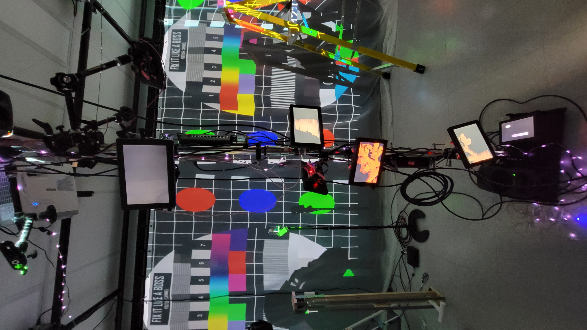

## **Effet Papillon**
Raphaël Dumont, Alexis Bolduc, William Morel, Alexia (Ryan) Papanikolaou, Viktor Zhuravlev et Jasmine Lapierre.
## le lien de chacun avec le thème Crescentia
Le lien avec Crescentia est que l'environnement évolue comme pour représenter le cycle de la vie sur Terre.
## l'installation en cours dans les studios
En ce moment, l'installation est dans le petit studio, avec le matériel interactif placé et les projecteurs prêt à afficher les interactions avec le matériel.
 

## Schéma
non disponible
   

De plus, vous devrez :

    identifier et indiquer 3 cours du programme qui vous semblent incontournables pour avoir les compétences pour créer ce genre projet (voir la grille de cours du programme)

    présenter une technique* ou une composante technologique* qui sera utilisée dans l'un des projets et que vous ne connaissiez pas

    *pour cette partie, vous devrez faire des recherches pour mieux connaitre la technique et la composante technologique retenues

    ordonner les projets selon votre préférence actuelle (1 = votre projet préféré), avec justification (avant/après l'expérimentation)

    noter ce que vous croyez que vous ressentirez en expérimentant chacune des installations, avec justification

Vous définirez la structure de votre présentation, en insérant des titres clairs, en intégrant des photographies lorsque cela est pertinent et en créant des fichiers agréables à lire, dans lesquels on repère facilement l'information
