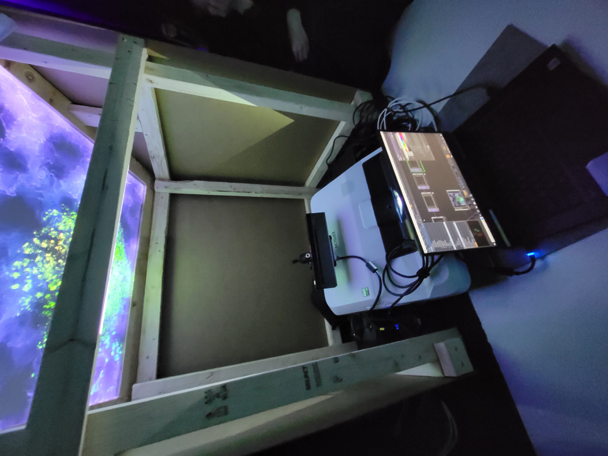

## **Rhizomatique**
Créateurs : Maïka Désy, Laurie Houde, Jolyanne Desjardins, Félix Testa

## Le lien de chacun avec le thème Crescentia
Le thème de Crescentia est la croissance, et c'est relié parce que le projet parle de la mémoire et des souvenirs qui arrivent et disparaisse au fil des temps.

## L'installation en cours dans les studios
L'installation se fait dans le grand studio. Elle se fais avec une toile (représentant le cerveau) et une projection sur 3 murs (l'affichage les souvenirs). Plus tu pèses longtemps, plus il va jouer longtemps et clairement, plus tu appuies rapidement, plus ils vont disparaître. Avoir le son de la vidéo mémoire avec un son de fond pour représenter l'émotion véhiculé dans la vidéo. une lumière au-devant de la toile attirera les gens, avec des modèles artistiques proejtés et sur la toile. puis dès qu'un interlocteur s'approchera, la lumière s'éteindra. les modèles artistiques partiront petit à petit.

source : Emmanuel Ricard

## Schéma
source : https://tim-montmorency.com/2024/projets/Rhizomatique/docs/web/preproduction.html

## 3 cours du programme incontournables pour créer ce genre projet
Œuvres et dispositifs multimédias en exposition, Interactivité ludique et Traitement audiovisuel semblent être des cours incontournables pour la création de cette oeuvre.

    présenter une technique* ou une composante technologique* qui sera utilisée dans l'un des projets et que vous ne connaissiez pas

    *pour cette partie, vous devrez faire des recherches pour mieux connaitre la technique et la composante technologique retenues

    ordonner les projets selon votre préférence actuelle (1 = votre projet préféré), avec justification (avant/après l'expérimentation)
## Ordre de préférence
avant l'expérimentation, je trouve que ce projet est mon 3ème préféré, car il est attirant avec sa façon de fonctionner et de synchroniser les contenus audios, visuels et physiques.

## Expérience à ressentir
Je crois que je vais expérimenter des émotions fortes, car elle va jouer avec les sentiments en nous immersant dans l'expérience.

source d'informations : https://tim-montmorency.com/2024/projets/Rhizomatique/docs/web/index.html
