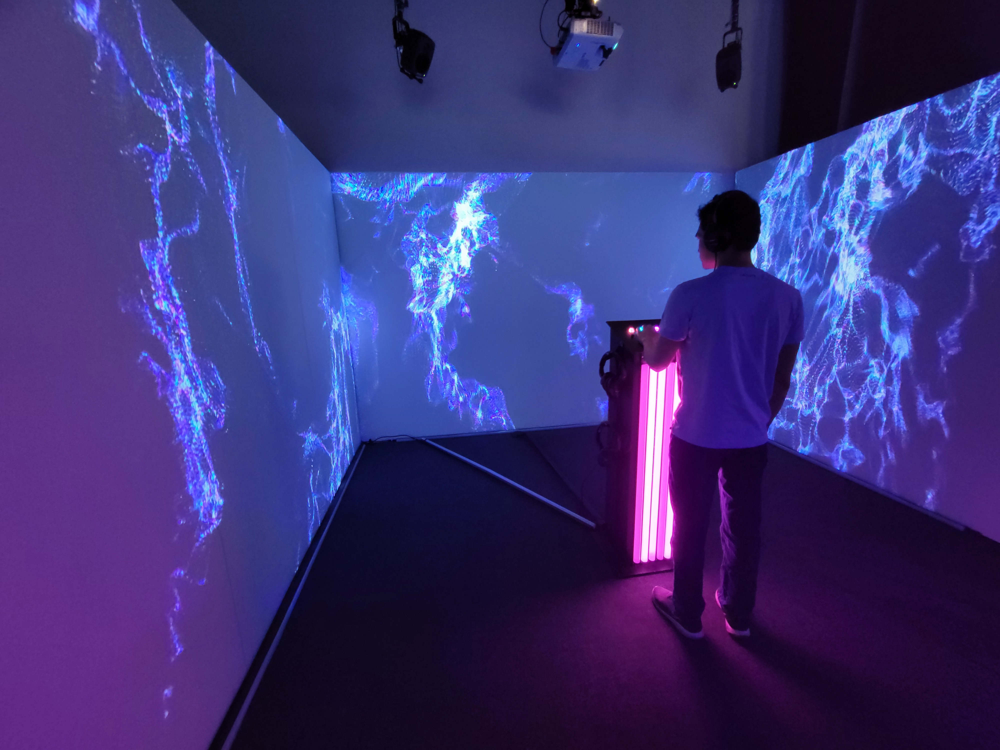
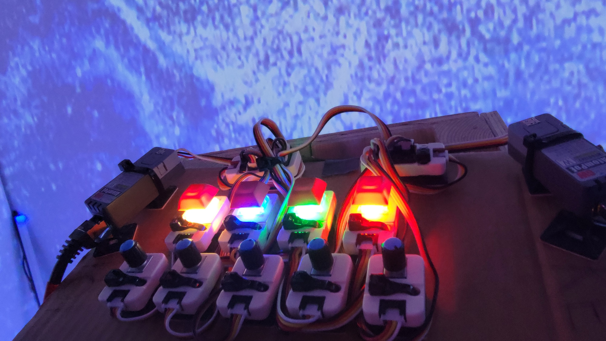

## **Sonalux**
Créateurs : Antoine Haddad, Camélie Laprise, Ghita Alaoui, Vincent Desjardins
## le lien avec le thème Crescentia
Le lien avec Crescentia est qu'il évolutif selon les actions posés avec le matériel.

## l'installation en cours dans les studios
En ce moment, l'installation est située dans le grand studio, dans un petit espace avec trois murs, projetés de vagues de lumières et des boutons pour contrôler ces vagues de lumières et contrôler le son. En appuyant sur un bouton, ça peut déclencher une action tel que ralentir la vidéo et le son, rajouter du son ou rajouter des particules dans la vidéo. Il y a des bandes au sol qui réagissent à l'appui des boutons.

source : Emmanuel Ricard
 

## Schéma de l'installation
source : https://tim-montmorency.com/2024/projets/Sonalux/docs/web/preproduction.html
   

## 3 cours du programme incontournables pour créer ce genre projet
Œuvres et dispositifs multimédias en exposition, Interactivité ludique et Traitement audiovisuel semblent être des cours incontournables pour la création de cette oeuvre.

## 3 cours du programme incontournables pour créer ce genre projet
Avant l'expérimentation, je trouve que ce projet est mon 2ème préféré, car il est attirant par sa liberté et sa créativité proposé lors de l'utilisation du projet.

## Expérience vécue
Je pense que je vais expérimenter de la satisfaction, car avoir le contrôle sur chaque effets possible avec le son et la vidéo est quelque chose qui donne l'effet d'une certaine liberté. développer

source d'informations : https://tim-montmorency.com/2024/projets/Sonalux/docs/web/index.html
