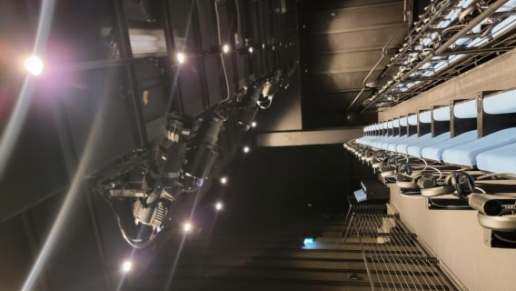
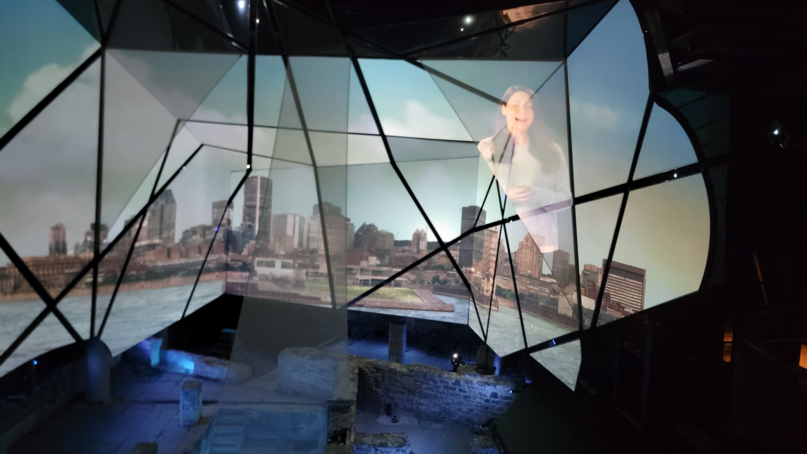

# Spectacle multimédia Générations MTL
*date de visite : 23 février 2024*

Source : Frédérique Ménard Aubin, https://pacmusee.qc.ca/fr/expositions/detail/spectacle-multimedia-generations-mtl/

## Lieu de mise en exposition
350 place royale, Montréal

Source : Emmanuel Ricard

## Type d'exposition
L'exposition est permanente et se retrouve à l'intérieur de l'édifice de Pointe-à-Callière.
Source : Emmanuel Ricard

## Titre de l'œuvre ou du dispositif
Spectacle multimédia Générations MTL
Source : https://pacmusee.qc.ca/fr/expositions/detail/spectacle-multimedia-generations-mtl/

## Nom de l'artiste ou de la firme
Pointe-à-Callière est la firme qui a développé ce projet.
Source : https://pacmusee.qc.ca/fr/expositions/detail/spectacle-multimedia-generations-mtl/
## Année de réalisation
2024 ?

## Description de l'œuvre ou du dispositif
La disposition parle de l'histoire du Québec et de ses origines. Elle est comportée de plusieurs écrans, d'écouteurs, de projecteurs et de néons. L'œuvre dure environs 17 minutes.
Source : https://pacmusee.qc.ca/fr/expositions/detail/spectacle-multimedia-generations-mtl/

## Type d'installation
Le type d'installation est plutôt contemplatif, car l'interlocuteur est assis sur une chaise et regarde de multiples écrans qui sont face à lui. Il y a aussi un peu d'immersion, parce que tu dois porter des écouteurs qui jouent du son tel que de la voix et de la musique pour t'immerger durant l'exposition.

Source : Emmanuel Ricard

## Fonction du dispositif multimédia
Le scénario parle de l'histoire du Québec depuis sa création jusqu'à aujourd'hui. Elle met en valeur tout ce que le Québec a traversé et toutes les créations que cette belle province a apportée. La diffusion ce fait sur plusieurs écrans, séparés de Néons, de projecteurs visant sur le sol pour projeter des éléments et d'écouteurs pour avoir une immersion plus profonde de l'œuvre. Il y avait aussi des vitres avec des personnages projetés de temps en temps dessus.

Source : Emmanuel Ricard

## Mise en espace
La partie visuelle prend la largeur d'un grand mur complet et de la moitié des deux murs sur les côtés. Elle prend aussi une partie du plancher. La partie avec les chaises pour que les visiteurs regardent est derrière, avec les écouteurs posés sur des socles entre les sièges. Au-dessus de cette partie, il y a des projecteurs pour projeter les images sur les vitres et au sol. Sur le mur de droite est située la porte pour rentrer dans la pièce.

Source : Emmanuel Ricard

## Composantes et techniques
Les composantes et les techniques utilisées sont la projection, la lumière, le son et la superposition. Certains projecteurs projetaient l'image sur le sol, ce qui rajoutait à l'immersion, tandis que d'autres projetaient sur des vitres invisibles, ce qui permettait de voir des personnes lorsque l'histoire en avait besoin, et lorsque la vitre n'avait rien d'affiché dessus de voir ce qui se passe derrière sur les écrans. Aussi, les lumières, telles que les néons entre les écrans, permettent de rajouter à l'immersion en faisant des effets qui vont avec ce qui est affiché et projeté sur les écrans. Pour finir, le son joue une grande partie dans cette œuvre, car il y a des voix qui expliquent ce qui se passe, à quelle époque nous sommes et il y a des sons avec de la musique pour nous immerger dans l'œuvre.

Source : Emmanuel Ricard

## Éléments nécessaires à la mise en exposition
Pour permettre l'exposition de cette œuvre, il faut avoir les équipements suivants : des projecteurs pour projeter les images, des lumières pour projeter de la lumière, des néons pour faire de la lumière, des sièges pour s'asseoir, des écouteurs pour entendre le son, de la vitre et des écrans pour recevoir la projection et un très grand espace divisé en plusieurs parties (une plus haute, et une plus basse).

## Expérience vécue
L'œuvre ne demande aucun effort physique, elle demande seulement à s'asseoir sur un siège, mettre les écouteurs et regarder l'exposition pour expérimenter un voyage au fil des années et revivre les événements marquant du Québec, plus précisément de Montréal. Elle procure de l'émerveillement et de la fierté vis-à-vis tout ce que Montréal a pu faire et ce qu'il est devenu aujourd'hui.

Source : Emmanuel Ricard

## ❤️ Ce qui m'a plu
Beaucoup d'éléments m'ont plus, tel que les sièges étaient disposés plus haut que la partie du sol ayant de la projection, ce qui fait un effet de projection plus agréable à regarder. Quelque chose qui m'a donné des idées est le fait qu'à la place de mettre les personnages au même stade de projection que les décors, ils ont mis des vitres où les projecteurs projettent la vidéo des personnages sans fond, ce qui crée un sentiment de réel et de rapprochement entre l'interlocuteur et l'exposition. Ça m'a beaucoup plu, car ça l'a rajouté à mon immersion et à la complicité que je ressentais avec les personnages, tout en permettant de bien admirer le paysage sans avoir de fonds encombrants derrière les personnages. 

## 🤔 Aspects que je ne retiendrais pas ou ferais autrement
Je ferais des moments plus courts pour les vidéos de fond à certains moments, car parfois, il ne se passait pas grand-chose, donc ça peut faire perdre l'attention des interlocuteurs. Si j'avais pu le faire différement, j'aurais laissé des fonds avec des passages moins intéressant sur certains écrans, mais j'aurais aussi mis des sujets plus intéressant pour capter l'attention tout en émerveillant les interlocuteurs.

*Sources :*

Emmanuel Ricard

Frédérique Ménard Aubin

https://pacmusee.qc.ca/fr/expositions/detail/spectacle-multimedia-generations-mtl/*
