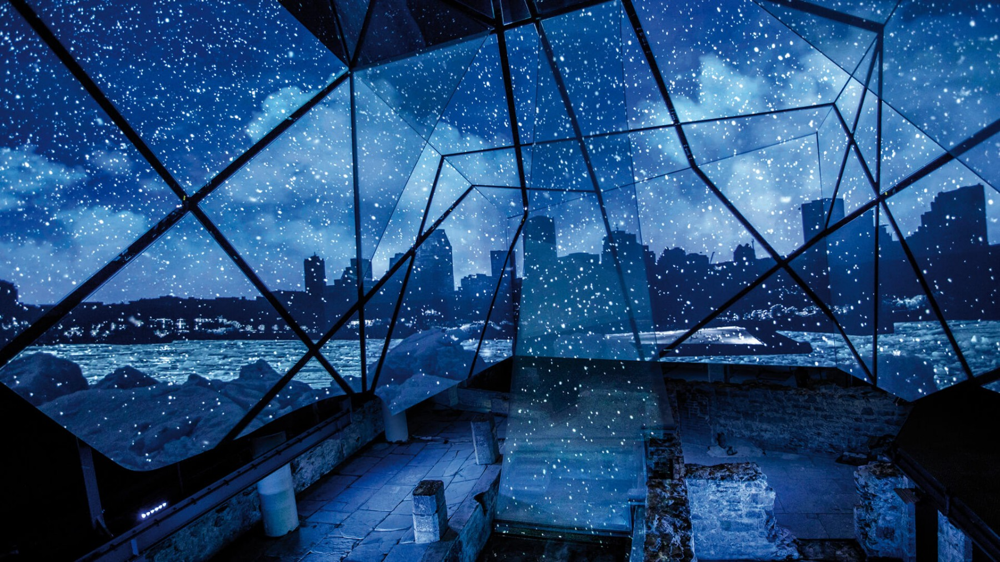
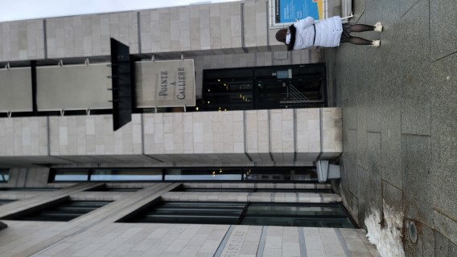
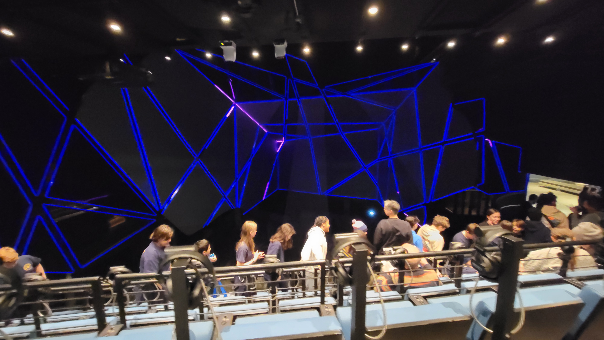
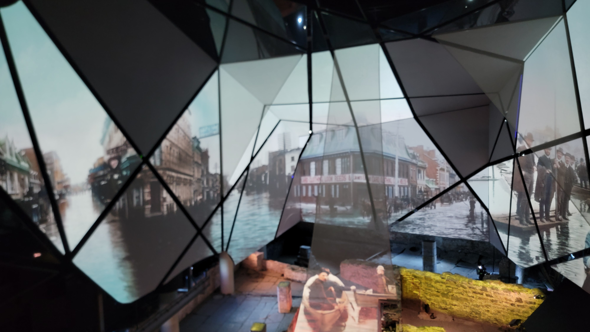

## **Spectacle multimédia Générations MTL**
date de visite : 23 février 2024

Source : Frédérique Ménard Aubin, https://pacmusee.qc.ca/fr/expositions/detail/spectacle-multimedia-generations-mtl/

## Lieu de mise en exposition
350 place royale Montréal

## Type d'exposition
L'exposition est permanente et se retrouve à l'intérieur de l'édifice de Pointe-à-Callière.

## Titre de l'oeuvre ou du dispositif
Spectacle multimédia Générations MTL

## Nom de l'artiste ou de la firme
Pointe-à-Callière est la firme qui a développé ce projet.
## Année de réalisation
2024?

## Description de l'oeuvre ou du dispositif
La disposition parle de l'histoire du Québec et de ses origines.2
Source : https://pacmusee.qc.ca/fr/expositions/detail/spectacle-multimedia-generations-mtl/

## Type d'installation
Le type d'installation est plutôt contemplative, car l'interlocuteur est assis sur une chaise et regarde de multiples écrans qui sont face à lui. Il y a aussi un peu d'immersion, car tu dois porter des écouteurs qui jouent du son tel que de la voix et de la musique pour t'immerser durant l'exposition.
Sources : Emmanuel Ricard

## Fonction du dispositif multimédia (scénographie, mise en valeur, mise en contexte, support pédagogique, diffusion du patrimoine immatériel)
Le scénario parle de l'histoire du Québec depuis sa création jusqu'à aujourd'hui. Elle met en valeur tout ce que le Québec a traversé et toutes les créations que cette belle province a apporté. La diffusion ce fait sur plusieurs écrans, séparés de Néons, de projecteurs visant sur le sol pour projeter des éléments et d'écouteurs pour avoir une immersion plus profonde de l'oeuvre. Il y avait aussi des vitres avec des personnages projetés de temps en temps dessus.
Source : Emmanuel Ricard

## Mise en espace
La partie visuelle prend la largeur d'un grand mur complet et de la moitié des deux murs sur les côtés. Elle prend aussi une partie du plancher. La partie avec les chaises pour que les visiteurs regarde est derrière, avec les écouteurs posés sur des socles entre les sièges. au dessus de cette partie, il y a des projecteurs pour projeter les images sur les vitres et au sol. Sur le mur de droite est située la porte pour rentrer dans la pièce.

## Composantes et techniques
Parties composantes de l'oeuvre ou du dispositif (il est possible d'utiliser des images tirées de sites internet pour faciliter la compréhension si les photos prises ne sont pas claires)
Liste des composantes et techniques utilisées (ce que l'artiste ou la firme a fait - pensez à ce qui doit voyager dans une caisse de transport si ceci est exposé outremer)

## Éléments nécessaires à la mise en exposition
Éléments de mise en exposition (il est possible d'utiliser des images tirées de sites internet pour faciliter la compréhension si les photos prises ne sont pas claires)
Liste des éléments nécessaires à la mise en exposition (ce que le musée a mis en place pour que l'oeuvre ou le dispositif soit exposé (bancs, cache-fil, crochets, sacs de sable, câbles, herses, projecteurs...)

## Expérience vécue
Posture du visiteur ou gestes de l'interacteur 🎥 possibilité d'intégrer de courts vidéos pour documenter les actions de l'oeuvre ou du dispositif ou l'interactivité avec l'oeuvre ou le dispositif
Texte qui explique ce qui est attendu du visiteur ou de l'interacteur. Où et comment se positionne-t-il/elle? Que faut-il faire? Comment réagit l'oeuvre ou le dispositif (si interactivité)? Plus personnellement, description de l'expérience que l'oeuvre ou le dispositif vous a fait vivre.

## ❤️ Ce qui vous a plu, vous a donné des idées
Éléments pertinents
Texte à rédiger qui présente un ou des aspects inspirants, avec justifications détaillées (pourquoi est-ce que cela vous a plus/ vous a donné des idées ?

## 🤔 Aspect que vous ne souhaiteriez pas retenir pour vos propres créations ou que vous feriez autrement
Éléments pertinents
 	Texte à rédiger qui présente un ou des aspects que vous ne retiendriez pas ou feriez autrement, avec justifications détaillées (pourquoi? comment?)

  Références
  hyperliens vers les sites consultés

source : https://pacmusee.qc.ca/fr/expositions/detail/spectacle-multimedia-generations-mtl/
